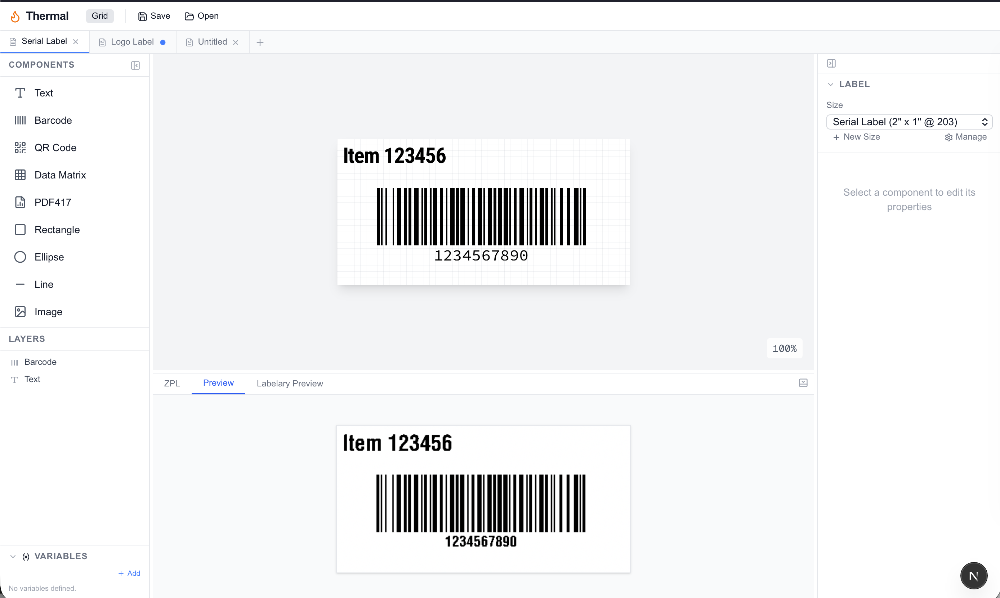

# Thermal

A visual label editor for Zebra thermal printers. Design your labels by dragging and dropping components onto a canvas, and Thermal generates the ZPL code your printer needs — no manual coding required.



## What it does

Thermal lets you build labels the way you'd expect — visually. Add text, barcodes, QR codes, shapes, and images to a canvas, arrange them where you want, and get printer-ready ZPL output instantly. A live preview shows you exactly what the printed label will look like before you waste a single sticker.

## Features

- **Visual drag-and-drop editor** — place and resize components directly on the label canvas
- **Live preview** — see the actual printed output as you design, powered by the [Labelary](http://labelary.com) rendering engine
- **Real-time ZPL generation** — the printer code updates as you edit, ready to copy or send
- **Barcodes and QR codes** — Code 128, Code 39, EAN-13, UPC-A, ITF, QR, Data Matrix, PDF417
- **Text with full control** — font size, width, rotation, multi-line wrapping, and justification
- **Anchor-based positioning** — pin components to edges or center them so layouts adapt when you change label sizes
- **Multiple label sizes** — common presets (4x6, 2x1, 3x2, etc.) at 203, 300, or 600 DPI, plus custom sizes
- **Image support** — import images with automatic monochrome conversion for thermal printing
- **Tabs** — work on multiple labels at once
- **Field variables** — define text, date, and counter variables for dynamic content at print time
- **Undo/redo** — full history for every change
- **Save and load** — persist your labels to a local database

## Getting started

```bash
npm install
npm run dev
```

Open [http://localhost:3000](http://localhost:3000) and start designing.

## How it works

You build labels by adding components from the palette on the left — text, barcodes, shapes, images — and positioning them on the canvas. Each component can be anchored to the label edges (left, right, center, top, bottom) so that switching between label sizes keeps everything in the right place.

The editor generates ZPL (Zebra Programming Language) in real time. The bottom panel shows three views:

- **ZPL** — the raw printer code, ready to copy
- **Preview** — a canvas-rendered approximation
- **Labelary Preview** — the actual printed output rendered by Labelary's API

All measurements are in dots (printer pixels). A 2" x 1" label at 203 DPI is 406 x 203 dots.

## Adding new component types

Thermal uses a plugin system. Each component type lives in its own folder:

```
lib/components/text/
  index.ts          # Definition (type name, defaults, traits)
  element.tsx       # How it looks on the canvas
  properties.tsx    # The properties panel UI
  zpl.ts            # How it converts to ZPL
```

Create a new folder, export a `ComponentDefinition`, and add one import to `lib/components/index.ts`. The palette, canvas, properties panel, and ZPL generator all pick it up automatically.

## Tech stack

Next.js 16, React 19, Zustand, Tailwind CSS 4, TypeScript

## License

MIT
